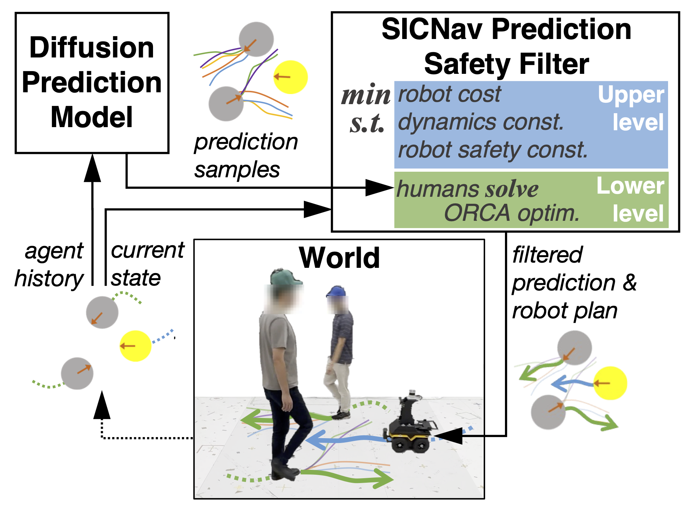

# SICNav and SICNav-Diffusion
This repository contains the code base for our 2024 IEEE Transactions on Robotics (T-RO) paper introducing *SICNav: Safe and Interactive Crowd Navigation using Model Predictive Control and Bilevel Optimization* and our followup 2025 IEEE Robotics and Automation Letters (RA-L) paper *SICNav-Diffusion: Safe and Interactive Crowd Navigation with Diffusion Trajectory Predictions*.

This code-base also includes the **CrowdSimPlus** simulator. CrowdSimPlus is based on OpenAI gym and is an extension of CrowdSim ([Repo](https://github.com/vita-epfl/CrowdNav), [Paper](https://arxiv.org/abs/1809.08835)), with the follwing added features:
- Static obstacles to allow for more realistic dense scenarios.
- Social Forces Model (SFM) policy to simulate human agents, in addition to the original Optimal Reciprocal Collision Avoidance (ORCA) policy. These policies can be found under `crowd_sim_plus.envs.policy`.
- [Stable Baselines 3 (SB3)](https://stable-baselines3.readthedocs.io/en/master/) integration for Reinforcement Learning (RL) methods.

## SICNav Paper T-RO 2024

**[`Website`](http://sepehr.fyi/projects/sicnav) | [`Repo`](https://github.com/sepsamavi/safe-interactive-crowdnav) | [`IEEE Xplore`](https://ieeexplore.ieee.org/document/10726864)| [`arXiv`](https://arxiv.org/abs/2310.10982) | [`Video`](https://tiny.cc/sicnav_overview)**

<p align="center">
    
    
</p>


```bibtex
@article{samavi2024sicnav,
  author={Samavi, Sepehr and Han, James R. and Shkurti, Florian and Schoellig, Angela P.},
  journal={IEEE Transactions on Robotics},
  title={SICNav: Safe and Interactive Crowd Navigation using Model Predictive Control and Bilevel Optimization},
  year={2024},
  volume={41},
  number={},
  pages={80-818},
  doi={10.1109/TRO.2024.3484634},
  url={https://arxiv.org/abs/2310.10982}}
```

## SICNav-Diffusion Paper RA-L 2025 (in press)
**[`Repo`](https://github.com/sepsamavi/safe-interactive-crowdnav) | [`arXiv`](https://arxiv.org/abs/2503.08858) | [`Video`](https://tiny.cc/sicnav_diffusion)**

<p align="center">
    
</p>

```
@article{samavi2025sicnavdiffusion,
      author={Sepehr Samavi and Anthony Lem and Fumiaki Sato and Sirui Chen and Qiao Gu and Keijiro Yano and Angela P. Schoellig and Florian Shkurti},
      journal={IEEE Robotics and Automation Letters (in press)},
      title={SICNav-Diffusion: Safe and Interactive Crowd Navigation with Diffusion Trajectory Predictions},
      year={2024},
      volume={},
      number={},
      pages={},
      url={https://arxiv.org/abs/2503.08858}}
```
## Setup
In a conda environment with Python 3.8.13,

1. Install this package using pip:
    ```
    pip install -e .
    ```
2. Install the required libraries:
    ````
    pip install -r requirements.txt
    ````
3. Clone and install [Python-RVO2](https://github.com/sybrenstuvel/Python-RVO2) library. Note that a compatible version of Cython `0.29.33` will be installed already in step 2. You should only need to run:
    ```
    cd <path-to-Python-RVO2-dir>/Python-RVO2/
    python setup.py build
    python setup.py install
    pip install -e .
    ```

4. (Recommended) Install HSL to use advanced solvers in IPOPT, the settings that we use in `campc.py` make use of a linear solver from HSL, however the code in this repo will work with the default IPOPT settings as well. Instructions: https://github.com/casadi/casadi/wiki/Obtaining-HSL.

5. (**To use real-time solver**) The SICNav versions that run in real-time, including SICNav-Diffusion, use the [Acados](https://github.com/acados/acados) solver [v0.2.6](https://github.com/acados/acados/releases/tag/v0.2.6). Complete installation instructions can be found on the [Acados website](https://github.com/acados/acados). To clone the version that we use,
    ```
    cd <where-you-want-acados-source-code>
    git clone https://github.com/acados/acados.git
    cd acados
    git checkout 285d382 # to obtain v0.2.6
    git submodule update --recursive --init
    ```
    After cloning the source code, please follow the [build instructions](https://docs.acados.org/installation/index.html#build-and-install-acados). Note that the build options are system-dependent and can have a large impact on the performance of the solver. Our use requires `-DACADOS_PYTHON=ON`.

    Finally, please follow the linked instructions to install the [Acados Python Interface](https://docs.acados.org/python_interface/index.html) into your conda environment. First activate your conda environment then follow [steps 3 and 4](https://docs.acados.org/python_interface/index.html).


## Testing Crowd Navigation Algorithms

### SICNav (2024 T-RO)
The following algorithms can be visualized by running the following commands in the repo's root directory:
```
python simple_test.py --policy <policy> --env_config sicnav/config/env.config --policy_config sicnav/config/policy.config
```

- Collision Avoidance MPC (`--policy campc`) can be configured in `sicnav/configs/policy.config` to act as the following algorithms described in the T-RO paper:
    - **SICNav-p (ours)**: our algorithm with access to privileged information about the humans
    - **SICNav-np (ours)**: our algorithm without access to privileged information about the humans
    - **MPC-CVMM**: the MPC baseline that does not model human interactively

- Dynamic Window Approach (`--policy dwa`)

To train and visualize the Reinforcement Learning algorithms, **SARL** and **RGL**, please see the `RL_nav/` subdirectory.

### SICNav-Diffusion (2025 RA-L)

The following algorithms can be visualized by running the following commands in the repo's root directory:
```
python simple_test.py --policy sicnav_acados
```
- The implementation of SICNav with the real-time Acados solver `--policy sicnav_acados` can be configured in `sicnav_diffusion/configs/policy.config` to act as the following algorithms described in the RA-L paper:
    - **SICNav-iMID (ours)**: by setting `human_pred_MID = true` and `human_pred_MID_vanil_as_joint = true`
    - **SICNav-iMID (ours)**: by setting `human_pred_MID = true` and `human_pred_MID_vanil_as_joint = true`
    - **SICNav-CVG (ours)**: by setting `human_goal_cvmm = true`. This setting is equivalent to SICNav-np in the T-RO paper, however **using the faster Acados solver rather than Casadi's built-in IPOPT as in the `sicnav` folder**.

Details regarding the training of human prediction models iMID and JMID can be found in `sicnav_diffusion/JMID/MID/ReadMe.md`.
#### Important Notes

- If you would like to use SICNav on your robot in real time, you can set `outdoor_robot_setting = True` for a real-time configuration of the Acados optimization problem, then call the `select_action(...)` function to obtain solutions. (File: `sicnav_diffusion/policy/sicnav_acados.py`)
- We use JITted Casadi functions which results in a dump of temporary files in this folder. To clean up these temporary files, you can run the command `bash clean_temp_files.sh`.
- **Acados Cache**: Acados generates C code of the problem then uses Just-in-time compilation (JIT) to achieve faster performance. We store the generated and compiled code in the `acados_cache` folder, using a hash key generated from the `env.config` and `policy.config` contents. This way, if you change something in the code, please ensure to remove the `acados_cache` folder in order to remove the out-dated cached Acados code/binaries.

## Contributors

This repository is primarily developed by [Sepehr Samavi](github.com/sepsamavi) (`sicnav`, `sicnav_diffusion` and `crowd_sim_plus`), [James R. Han](github.com/james-r-han) (`RL_nav` and `crowd_sim_plus`), [Anthony Lem](github.com/anthonyjlem) (`JMID`) and Fumiaki Sato (`JMID`).