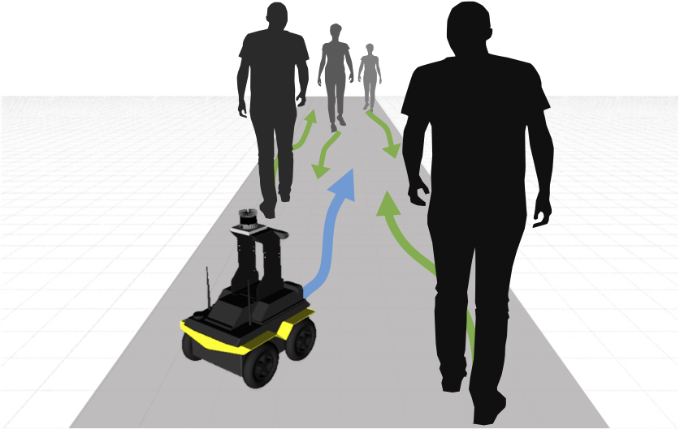
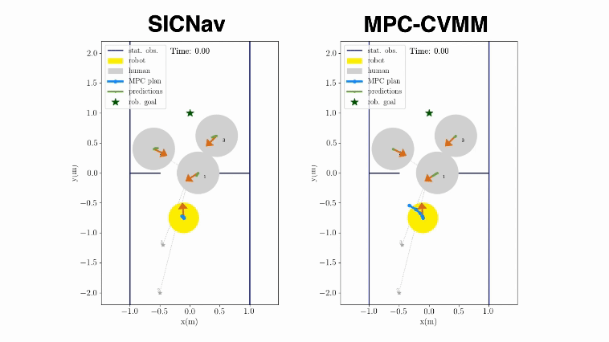

# Safe and Interactive Crowd Navigation
This repository contains the code for our paper **SICNav: Safe and Interactive Crowd Navigation using Model Predictive Control and Bilevel Optimization** including the CrowdSimPlus Simulator.

**[`Website`](http://sepehr.fyi/projects/sicnav) | [`Repo`](https://github.com/sepsamavi/safe-interactive-crowdnav) | [`Paper`](https://arxiv.org/abs/2310.10982) | [`Video`](https://tiny.cc/sicnav_overview)**

<p align="center">
    
    
</p>


```bibtex
@misc{samavi2023sicnav,
      title={SICNav: Safe and Interactive Crowd Navigation using Model Predictive Control and Bilevel Optimization},
      author={Sepehr Samavi and James R. Han and Florian Shkurti and Angela P. Schoellig},
      year={2023},
      eprint={2310.10982},
      archivePrefix={arXiv},
      primaryClass={cs.RO},
      note={Currently under Review for the IEEE Transactions on Robotics (T-RO).}
}
```


## Setup
In a conda environment with Python 3.8.13,

1. Install this package using pip:
    ```
    pip install -e .
    ```
2. Install the required libraries:
    ````
    pip install -r requirements.txt
    ````
3. Clone and install [Python-RVO2](https://github.com/sybrenstuvel/Python-RVO2) library. Note that a compatible version of Cython `0.29.33` will be installed already in step 2. You should only need to run:
    ```
    pip install -e <path-to-Python-RVO2-dir>/Python-RVO2/
    ```

4. (Recommended) Install HSL to use advanced solvers in IPOPT, the settings that we use in `campc.py` make use of a linear solver from HSL, however the code in this repo will work with the default IPOPT settings as well. Instructions: https://github.com/casadi/casadi/wiki/Obtaining-HSL.

## Testing Crowd Navigation Algorithms

The following algorithms can be visualized by running the following command in the `sicnav/` directory:
```
python simple_test.py --policy <policy>
```

- Collision Avoidance MPC (`--policy campc`) can be configured in `sicnav/configs/policy.config` to act as the following algorithms described in the paper:
    - **SICNav-p (ours)**: our algorithm with access to privileged information about the humans
    - **SICNav-np (ours)**: our algorithm without access to privileged information about the humans
    - **MPC-CVMM**: the MPC baseline that does not model human interactively

- Dynamic Window Approach (`--policy dwa`)

To train and visualize the Reinforcement Learning algorithms, **SARL** and **RGL**, please see the `RL_nav/` subdirectory.

## CrowdSimPlus Simulator

CrowdSimPlus is based on OpenAI gym and is an extension of CrowdSim ([Repo](https://github.com/vita-epfl/CrowdNav), [Paper](https://arxiv.org/abs/1809.08835)), with the follwing added features:
- Static obstacles to allow for more realistic dense scenarios.
- Social Forces Model (SFM) policy to simulate human agents, in addition to the original Optimal Reciprocal Collision Avoidance (ORCA) policy. These policies can be found under `crowd_sim_plus.envs.policy`.
- [Stable Baselines 3 (SB3)](https://stable-baselines3.readthedocs.io/en/master/) integration for Reinforcement Learning (RL) methods.

## Contributors

This repository is primarily developed by [Sepehr Samavi](https://github.com/sepsamavi) (`sicnav` and `crowd_sim_plus`) and [James R. Han](https://github.com/james-r-han) (`RL_nav` and `crowd_sim_plus`).
